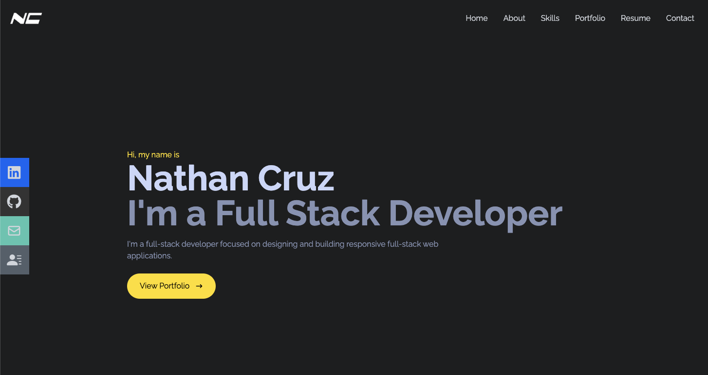
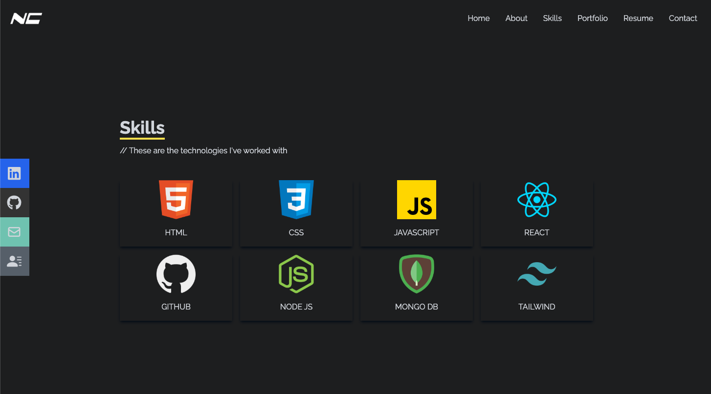
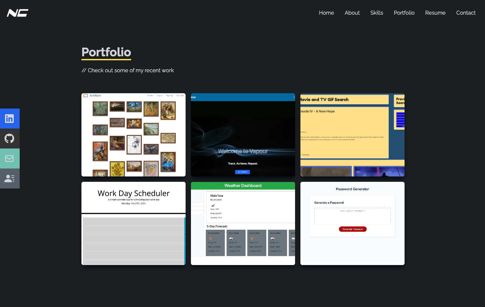

# ncruz-portfolio
A personal portfolio built using React

## Description

This is an updated version of my portfolio using React to include a better UI with React smooth scroll and an overall improved design. My orginal portfolios can be compared here: [version 1.0](https://crzn24.github.io/ncruz-coding-portfolio/) and [version 2.0](https://crzn24.github.io/ncruz-react-portfolio/).
The original task during bootcamp was a challenge where we had to create a new version of our portfolio using React without starter code. Every developer needs a place to share projects while applying for jobs or working as a freelancer but also to share our work with other developers. I was able to make this during my free time using notes taken and previous knowledge learned during bootcamp, tutorials, and just experiementing. I was able to make a very responsive portfolio compared to my previous versions that is mobile friendly and had some nice interactive elements, including a smooth scroll feature that I learned from tutorials.


<!-- Provide a short description explaining the what, why, and how of your project. Use the following questions as a guide:

- What was your motivation?
- Why did you build this project? (Note: the answer is not "Because it was a homework assignment.")
- What problem does it solve?
- What did you learn? -->

<!-- ## User Story

```
AS A future junior developer and bootcamp graduate
I WANT a portfolio that showcases my past projects 
SO THAT employers can have a better assessment of my technical skills and consider me as a candidate for any open positions
``` -->
## Table of Contents

<!-- If your README is long, add a table of contents to make it easy for users to find what they need. -->

- [ncruz-portfolio](#ncruz-portfolio)
  - [Description](#description)
  - [Table of Contents](#table-of-contents)
  - [Installation](#installation)
  - [Credits](#credits)
  - [License](#license)
  - [Badges](#badges)
  - [Features](#features)
  - [Contribution](#contribution)
  - [Tests](#tests)
  - [Questions](#questions)

## Installation

No installation is required. 
Check out the [deployed app!](https://crzn24.github.io/ncruz-portfolio/)

<!-- What are the steps required to install your project? Provide a step-by-step description of how to get the development environment running. -->






<!-- Provide instructions and examples for use. Include screenshots as needed.

To add a screenshot, create an `assets/images` folder in your repository and upload your screenshot to it. Then, using the relative filepath, add it to your README using the following syntax:

    ```md
    
    ``` -->

## Credits

This portfolio was styled using: 
* [Tailwind CSS](https://tailwindcss.com/docs/installation)
* [React smooth scroll](https://www.npmjs.com/package/react-scroll)
* [Opening links in new tab](https://www.w3schools.com/tags/att_a_target.asp)


## License


<!-- The last section of a high-quality README file is the license. This lets other developers know what they can and cannot do with your project. If you need help choosing a license, refer to [https://choosealicense.com/](https://choosealicense.com/). -->

---

<!-- 🏆 The previous sections are the bare minimum, and your project will ultimately determine the content of this document. You might also want to consider adding the following sections. -->

## Badges


<!--  -->

<!--  -->

<!-- Badges aren't necessary, per se, but they demonstrate street cred. Badges let other developers know that you know what you're doing. Check out the badges hosted by [shields.io](https://shields.io/). You may not understand what they all represent now, but you will in time. -->

## Features

This page features:

- React smooth scroll
- React components
- Mobile friendly and responsive
- Deployed using gh-pages
- Side elements with links to profiles and contact
- Navbar that links to corresponding pages
- Portfolio page with links to deployed apps and repos
- Downloadable resume
- Contact form

<!-- If your project has a lot of features, list them here. -->

<!-- ## How to Contribute

If you created an application or package and would like other developers to contribute it, you can include guidelines for how to do so. The [Contributor Covenant](https://www.contributor-covenant.org/) is an industry standard, but you can always write your own if you'd prefer. -->

## Contribution 
N/A
## Tests

- Click 'View Portfolio' button on home page to automatically scroll to first component.
- Click any item in the navbar to be redirected to the corresponding page component.
- Resize window or open on mobile device to see responsive content elements and collapsing navbar menu.
- Click responsive side elements to be taken to LinkedIn profile, GitHub profile, send an email, or download resume.
- Click on any portfolio items' links to open deployed app or repo in a new tab.
<!-- Go the extra mile and write tests for your application. Then provide examples on how to run them here. -->

## Questions
Github: crzn24